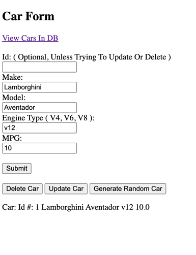

Project Setup

- docker build --no-cache -t spring-boot-mvc-app-image .
- docker run -p 8080:8080 --name spring-boot-mvc-app-container spring-boot-mvc-app-image
- open web browser and navigate to http://localhost:8080

This is the simple Spring Boot MVC application that demonstrates the following:
